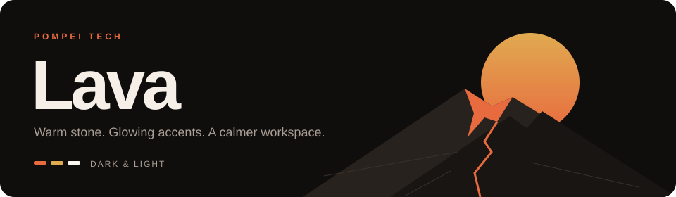
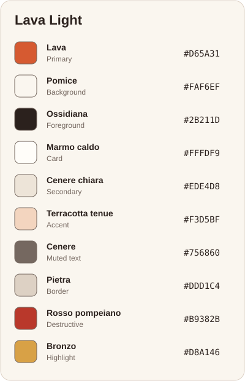
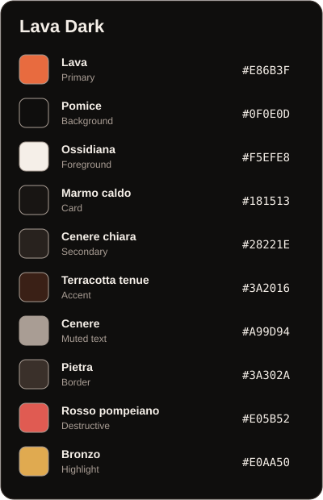

<div align="center">
  
  <h1>Lava</h1>
  <p>Volcanic warmth for your editor, terminal and workspace.<br />Two coordinated themes: <strong>Lava Dark</strong> and <strong>Lava Light</strong>.</p>
  <p><a href="#palette">Explore the palette</a> · <a href="#installation">Install a theme</a> · <a href="#development">Develop a port</a></p>
</div>

---

## Palette

The single source of truth is [`palette/lava.json`](palette/lava.json). It mirrors the brand spec:

<div align="center">
  
  
</div>

The light variant adds an `editor` block: neutral ivory surfaces, ink text, a deeper lava accent, and a cool selection. These overrides preserve the original brand tokens and are shared by all generated ports.

The `syntax` block adds the extra hues a code editor needs (olive, fresco teal, sky blue, rose…). They are defined in OKLCH at the same warmth as the brand colors, and every one of them reaches at least WCAG AA contrast (4.5:1) on its background. The light variant uses burnt orange for keywords and a darker bronze for types; bright bronze is reserved for filled highlights.

## Installation

Choose your tool below. Examples use **Lava Dark**; switch `dark` to `light` for the light variant, or select **Lava Light** where a display name is required.

| Tool | Location |
| --- | --- |
| [Neovim](#neovim) | repository root (`colors/`, `lua/lava/`) |
| [VS Code](#vs-code) | [`vscode/`](vscode) |
| [WezTerm](#wezterm) | [`extras/wezterm`](extras/wezterm) |
| [tmux](#tmux) | TPM plugin (`lava.tmux` at the root) |
| [lualine](#neovim) | ships with the Neovim plugin (`theme = "lava"`) |
| [lazygit](#lazygit) | [`extras/lazygit`](extras/lazygit) |
| [iTerm2](#iterm2) | [`extras/iterm`](extras/iterm) |
| [fzf](#shell-zsh) | [`extras/fzf`](extras/fzf) (also applied to tmux popups by the tmux plugin) |
| [zsh suggestions / completion / syntax](#shell-zsh) | [`extras/zsh`](extras/zsh) |
| [powerlevel10k](#shell-zsh) | [`extras/p10k`](extras/p10k) |
| [kitty](#kitty-ghostty-alacritty) | [`extras/kitty`](extras/kitty) |
| [Ghostty](#kitty-ghostty-alacritty) | [`extras/ghostty`](extras/ghostty) |
| [Alacritty](#kitty-ghostty-alacritty) | [`extras/alacritty`](extras/alacritty) |
| [Slack](#slack) | [`extras/slack`](extras/slack) |

<a id="neovim"></a>

<details open>
<summary><strong>Neovim</strong></summary>

```lua
-- lazy.nvim
{
  "pompeitech/pompeitech",
  lazy = false,
  priority = 1000,
  opts = {
    -- style = "dark",        -- "dark" | "light" | nil (nil follows vim.o.background)
    -- transparent = false,
    -- italic_comments = true,
    -- lazygit = true,         -- apply Lava to LazyGit launched from Neovim
    -- on_colors = function(colors) end,
    -- on_highlights = function(hl, colors) end,
  },
  config = function(_, opts)
    require("lava").setup(opts)
    vim.cmd.colorscheme("lava")
  end,
}
```

Colorschemes: `lava` (follows `background` / `style`), `lava-dark`, `lava-light`.

Integrated plugins: lualine (`theme = "lava"`, `"lava-dark"`, `"lava-light"`), barbecue/navic (`theme = "auto"`), neo-tree, noice, snacks, trouble, telescope, blink.cmp, which-key, gitsigns, todo-comments, rainbow-delimiters, lazy.nvim, mason, octo.nvim, copilot, yanky.

</details>

<a id="vs-code"></a>

<details>
<summary><strong>VS Code</strong></summary>

```sh
cd vscode && npx @vscode/vsce package   # produces lava-theme-<version>.vsix
code --install-extension lava-theme-*.vsix
```

For local development, open `vscode/` in VS Code and press F5.

</details>

<a id="wezterm"></a>

<details>
<summary><strong>WezTerm</strong></summary>

```lua
config.color_scheme_dirs = { "/path/to/pompeitech/extras/wezterm" }
config.color_scheme = "Lava Dark"
```

</details>

<a id="tmux"></a>

<details>
<summary><strong>tmux</strong></summary>

With [TPM](https://github.com/tmux-plugins/tpm):

```tmux
set -g @plugin 'pompeitech/pompeitech'
set -g @lava_style 'dark'   # or 'light'
```

Then press `prefix + I`. Without TPM: `source-file /path/to/pompeitech/extras/tmux/lava-dark.tmux`.

The theme also colors every popup (`popup-style`, `popup-border-style`) and sets defaults for these plugins. Each value is applied only if you haven't set it yourself:

| Plugin | Options set |
| --- | --- |
| [tmux-floax](https://github.com/omerxx/tmux-floax) | `@floax-border-color`, `@floax-text-color` |
| [tmux-sessionx](https://github.com/omerxx/tmux-sessionx) | `@sessionx-additional-options` (fzf colors) |
| [tmux-prefix-highlight](https://github.com/tmux-plugins/tmux-prefix-highlight) | `@prefix_highlight_fg`, `@prefix_highlight_bg` |

Declare `@plugin 'pompeitech/pompeitech'` **before** those plugins so they pick the colors up when they load. floax is refreshed anyway if it loads first.

</details>

<a id="lazygit"></a>

<details>
<summary><strong>lazygit</strong></summary>

In Neovim, Lava automatically adds its theme to `LG_CONFIG_FILE`, preserving your personal configuration. Reopen LazyGit after changing the colorscheme. Set `lazygit = false` in `setup()` to manage its theme yourself.

For standalone LazyGit, keep your own config and add the theme on top:

```sh
export LG_CONFIG_FILE="$HOME/Library/Application Support/lazygit/config.yml,/path/to/pompeitech/extras/lazygit/lava-dark.yml"
```

With `lazygit.nvim`:

```lua
vim.g.lazygit_use_custom_config_file_path = 1
vim.g.lazygit_config_file_path = {
  vim.fn.expand("~/Library/Application Support/lazygit/config.yml"), -- your own config (macOS default path)
  vim.fn.stdpath("data") .. "/lazy/pompeitech/extras/lazygit/lava-dark.yml",
}
```

</details>

<a id="shell-zsh"></a>

<details>
<summary><strong>Shell (zsh)</strong></summary>

```zsh
export LAVA_STYLE="dark"                           # or "light"
export LAVA_HOME="$HOME/.local/share/nvim/lazy/lava" # any clone of this repo
source $LAVA_HOME/extras/fzf/lava-$LAVA_STYLE.sh     # fzf colors (idempotent)
source $LAVA_HOME/extras/p10k/lava-$LAVA_STYLE.zsh   # after ~/.p10k.zsh
```

Use the same `LAVA_STYLE` as your terminal background: `light` for a light terminal. The p10k theme also loads matching autosuggestion, completion menu, and syntax colors. Load it after your shell plugins. Without p10k, source `$LAVA_HOME/extras/zsh/lava-$LAVA_STYLE.zsh` directly.

powerlevel10k's lean style hardcodes the git colors inside `my_git_formatter`. To let Lava color them, change those four lines in `~/.p10k.zsh` so they read the Lava variables and keep the originals as fallback:

```zsh
local      clean=${LAVA_GIT_CLEAN:-'%76F'}
local   modified=${LAVA_GIT_MODIFIED:-'%178F'}
local  untracked=${LAVA_GIT_UNTRACKED:-'%39F'}
local conflicted=${LAVA_GIT_CONFLICTED:-'%196F'}
```

</details>

<a id="iterm2"></a>

<details>
<summary><strong>iTerm2</strong></summary>

Settings → Profiles → Colors → Color Presets… → Import… → `extras/iterm/lava-dark.itermcolors`, then select it from the same menu.

</details>

<a id="kitty-ghostty-alacritty"></a>

<details>
<summary><strong>kitty · Ghostty · Alacritty</strong></summary>

```conf
# kitty.conf
include /path/to/pompeitech/extras/kitty/lava-dark.conf
```

```conf
# ghostty config (or copy the file into ~/.config/ghostty/themes/)
theme = /path/to/pompeitech/extras/ghostty/lava-dark
```

```toml
# alacritty.toml
[general]
import = ["/path/to/pompeitech/extras/alacritty/lava-dark.toml"]
```

</details>

<a id="slack"></a>

<details>
<summary><strong>Slack</strong></summary>

Copy the single line from [`extras/slack/lava-dark.txt`](extras/slack/lava-dark.txt) or [`extras/slack/lava-light.txt`](extras/slack/lava-light.txt).
In Slack, open **Preferences → Appearance → Custom theme → Import theme**, paste the legacy theme colors, then click **Apply**.
See [Slack's theme guide](https://slack.com/help/articles/205166337-Change-your-Slack-theme).

The legacy fields are: sidebar background, menu background, selected item background, selected item text, hover background, text, active presence, mention badge, top bar background, and top bar text.
Surfaces, text, selection, and notifications use the brand palette; presence uses the existing syntax green. Both variants are generated from `palette/lava.json`.
Slack adapts legacy themes to its current design, so the imported result may differ from the original colors. For a flat appearance, disable **Window gradient**. Set Slack's light/dark mode separately to match the variant.

</details>

## Development

Everything under `extras/`, `vscode/themes/` and `lua/lava/palettes/` is **generated**. Don't edit those files by hand:

```sh
# edit palette/lava.json (or scripts/derive.mjs for the spec → editor mapping), then
npm run build
```

- `scripts/color.mjs`: OKLCH ↔ sRGB conversions (CSS Color 4) and contrast helpers
- `scripts/derive.mjs`: maps the brand tokens onto the flat color set the ports use
- `scripts/build.mjs`: one template per target; add a new tool by adding an entry to `targets`

Neovim highlight groups are hand-written in `lua/lava/highlights.lua`.

---

<div align="center">
  <sub>Made by <a href="https://github.com/pompeitech">Pompei Tech</a> · One palette, every tool.</sub>
</div>
